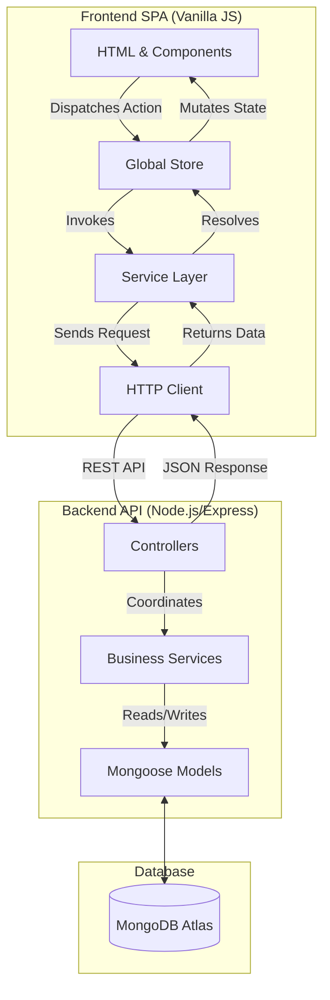
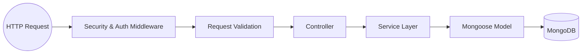
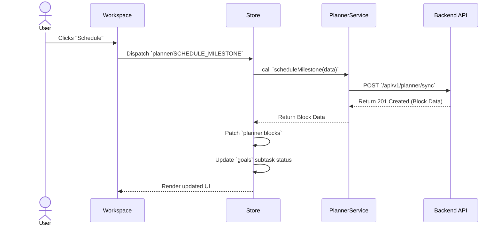
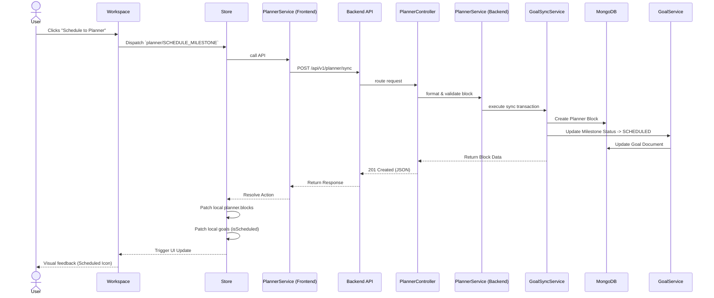

# StudyFlow Architecture

**StudyFlow** is an AI-first productivity workspace built specifically for deep student focus. It combines goal planning, calendar-based scheduling, task management, and focus tracking into a unified, distraction-free environment.

The core design philosophy emphasizes **cleanliness, explicit boundaries, and data integrity**. The architecture is built to ensure that moving a task from a long-term goal onto a daily planner and finally completing it is robust, consistent, and fast.

This document serves as the definitive reference for how the system is organized, how data flows, and why certain architectural decisions were made.

---

## 1. High-Level System Architecture

StudyFlow operates on a standard client-server model, optimized for a single-page application (SPA) experience without heavy frontend frameworks.



The system ensures a unidirectional data flow: actions trigger state changes, which talk to the backend, which returns data that mutates the store, automatically cascading down to the UI components.

---

## 2. Frontend Architecture

The frontend is a vanilla JavaScript Single Page Application (SPA). It avoids the complexity of frameworks like React or Vue in favor of a lightweight, highly custom architecture.

- **HTML Pages & Shared Components:** Each major view (Dashboard, Planner, Workspace) has a dedicated `.html` file. Reusable HTML snippets (Navbar, Sidebar, Task Cards) are stored as template strings and rendered dynamically.
- **Global Store:** State management is handled by a custom Vuex/Redux-like store. It maintains the single source of truth for goals, planner blocks, and user state.
- **Service Layer:** Encapsulates all external API calls. Components never make fetch requests directly; they dispatch actions to the store, which uses the service layer.
- **Router:** A lightweight client-side router intercepts navigation and swaps the main content area without full page reloads.
- **Component Rendering:** UI updates are surgical. Instead of virtual DOM diffing, specific DOM nodes are targeted and updated when state changes.

### State Synchronization
To maintain a snappy user experience, the frontend uses **optimistic local patching**. When an action succeeds on the backend, the store immediately patches its local state rather than re-fetching the entire dataset from the API, preventing unnecessary network overhead.

---

## 3. Backend Architecture

The backend is a Node.js REST API built with Express, following a strict layered architecture to separate concerns.



- **Express Application:** The entry point (`app.js`), responsible for routing, security headers (Helmet), and global error handling.
- **Controllers:** Extract parameters from the request, invoke the appropriate service, and format the JSON response. They contain **no business logic**.
- **Services:** The core of the application. They contain all business rules, orchestration, and database transactions.
- **Models:** Mongoose schemas that define data structures, strict validation rules, and schema-level hooks.
- **Validation:** Input is validated strictly before reaching the controller.
- **Error Handling:** A centralized error handler converts known application errors (`AppError`) into standardized JSON formats.
- **Logging:** Structured logging using `pino` ensures that all requests, errors, and system events are machine-readable for production monitoring.

---

## 4. Database Architecture

The system is backed by MongoDB. The collections are designed to be relatively normalized to prevent data anomalies, relying on the application layer to enforce consistency.

### Main Collections:
- **Users**: Core account details, authentication hashes, and preferences.
- **Goals**: High-level objectives broken down into actionable `subtasks` (milestones).
- **Planner Blocks**: Individual time blocks on the calendar.
- **Tasks**: Standalone to-do items (independent of goals).
- **Focus Sessions**: Immutable records of completed Pomodoro/focus intervals.

### Relationships:
A **Goal** contains an array of embedded subtasks. A **Planner Block** may optionally reference a specific `goalId` and `milestoneId`. This creates a critical relationship where a milestone is considered "scheduled" if a corresponding Planner Block exists.

---

## 5. Goal ↔ Planner Synchronization

The most complex and critical part of StudyFlow is keeping long-term Goals synchronized with daily Planner Blocks. 

### Synchronization Guarantees
If a milestone is scheduled in the planner, the milestone in the Goal document must have its status set to `SCHEDULED`. If the planner block is deleted, the milestone must revert to `PENDING`. If the milestone is completed, the planner block must also be completed.

### Application-Level Rollback
Because MongoDB Replica Sets (and thus multi-document transactions) might not be available in all deployment environments, StudyFlow implements **application-level two-phase commits with rollback compensation**.

When a user schedules a milestone:
1. `PlannerService` creates the block.
2. `GoalSyncService` attempts to update the Goal milestone status.
3. If the Goal update fails, `GoalSyncService` **rolls back** the operation by deleting the newly created planner block, ensuring the system never enters an inconsistent state (an orphaned block).

### Role Separation
- **`PlannerService`**: Strictly manages calendar operations (conflicts, resizing, CRUD).
- **`GoalService`**: Strictly manages goal operations (progress, subtasks).
- **`GoalSyncService`**: The orchestrator that bridges the two, enforcing synchronization rules and handling rollbacks.

---

## 6. Frontend State Flow

To ensure the UI remains instantly responsive across different views (Workspace, Dashboard, Planner), state flows in a strict loop:



**Why local store patching?** 
Previously, a full goal reload was triggered after a scheduling event. This was slow and caused UI flickering. Local patching allows the frontend to manually mutate the subtask status to `SCHEDULED` immediately upon a successful 200 OK response from the backend.

---

## 7. Error Handling

StudyFlow standardizes all API errors to ensure frontend reliability. 

- **`AppError`**: A custom extension of the native `Error` class that includes HTTP status codes and machine-readable application codes.
- **Error Codes**: Standardized strings (e.g., `ERR_VALIDATION`, `ERR_NOT_FOUND`, `ERR_INTERNAL_SERVER`) replace generic text messages, allowing the frontend to react programmatically.
- **Middleware**: The centralized `errorHandler.js` catches all exceptions. In production, it suppresses stack traces and normalizes unexpected errors into `ERR_INTERNAL_SERVER` to prevent information leakage.

---

## 8. Logging

Generic `console.log` is insufficient for a production backend. StudyFlow uses **structured logging** (via `pino`).

- **Machine-Readable**: All logs are output in JSON format, making them easily searchable in centralized log aggregation tools (like Datadog or ELK).
- **Contextual**: Logs automatically include Request IDs, HTTP methods, and URL paths.
- **Security**: Sensitive data (passwords, tokens) are explicitly redacted or never logged.
- **Levels**: The system utilizes standard log levels (`info`, `warn`, `error`, `debug`), allowing operators to filter noise in production while retaining high verbosity in development.

---

## 9. Testing Strategy

StudyFlow employs a rigorous automated testing strategy to prevent regressions, particularly in synchronization logic.

- **Unit Tests**: Test individual utility functions and pure logic.
- **Integration Tests (Jest + Supertest)**: The primary testing layer. Tests interact with the actual Express endpoints and a live (but isolated) MongoDB test database.
- **Focus Areas**: The highest coverage is mandated for `GoalSyncService`, ensuring that creation, deletion, completion, and rollback workflows function correctly under all edge cases.

---

## 10. Project Structure

The monorepo is divided strictly into frontend and backend ecosystems.

```
StudyFlow-AI/
├── docs/                 # Architectural documentation and release notes
├── frontend/             # Vanilla SPA
│   ├── components/       # Reusable HTML snippets (Navbar, Modals)
│   ├── src/
│   │   ├── css/          # Tailwind/Custom styling
│   │   └── js/           # Store, Services, and UI logic
│   └── *.html            # Main views (index, dashboard, planner, etc.)
└── backend/              # Express API
    ├── src/
    │   ├── controllers/  # Request parsing & response mapping
    │   ├── middleware/   # Express middleware (Auth, Errors)
    │   ├── models/       # Mongoose Database schemas
    │   ├── routes/       # API route definitions
    │   └── services/     # Core Business Logic & Orchestration
    └── tests/            # Automated Jest test suites
```

---

## 11. Design Decisions

### Application Rollback Instead of MongoDB Transactions
*Decision*: Use manual compensation logic instead of `session.withTransaction()`.
*Reasoning*: MongoDB requires a Replica Set for transactions. Local development or basic managed databases often use standalone instances. Application-level rollback ensures the codebase is portable and environment-agnostic.

### Service Layer Architecture
*Decision*: Extract all business logic from controllers into dedicated services.
*Reasoning*: Controllers should only care about HTTP. Services can be called by other services (e.g., `GoalSyncService` calling `PlannerService`), enabling code reuse and easier unit testing.

### Centralized Frontend Store (No Full Reloads)
*Decision*: Use a custom global state manager rather than relying on standard DOM manipulation or frequent API fetches.
*Reasoning*: A productivity app requires instant feedback. Mutating a local store and surgically updating the DOM prevents layout shifts and provides a "native app" feel.

### Structured Logging & API Error Codes
*Decision*: Replace text-based responses with structured error codes (`ERR_NOT_FOUND`) and JSON logs.
*Reasoning*: Prevents frontend breakage when a developer rewrites an error message string. Simplifies production monitoring.

---

## 12. Current Status

### Completed
- **Phase 2.1**: Base architecture, core data models, user authentication.
- **Phase 2.2**: Goal ↔ Planner Synchronization, API error standardization, structured logging, UI consistency.

### Current
- **Current Version**: `v2.1.0`
- **Current Development Branch**: `planner-recovery`
- **Architecture Status**: **Stable**

---

## 13. Future Roadmap

*Phase 2.3 and beyond will focus on:*
- **Focus Mode**: Integration of the Pomodoro timer with scheduled planner blocks.
- **Dashboard Intelligence**: AI-driven prioritization of daily tasks.
- **Planner UX**: Drag-and-drop rescheduling and recurring events.
- **Goal Progress**: Enhanced visualization of milestone completion over time.
- **AI Productivity**: Integrating IdeaLab workflows with real LLM processing.

---

## 14. Authentication Flow

```
Client                     Backend
  │                           │
  │── POST /api/v1/auth/login ──▶│
  │                           │  1. Validate credentials
  │                           │  2. bcrypt.compare(password, hash)
  │                           │  3. jwt.sign({ userId, role })
  │◀── { token, user } ────────│
  │                           │
  │── GET /api/v1/goals ───────▶│
  │   Authorization: Bearer <token>
  │                           │  4. auth.middleware.js verifies JWT
  │                           │  5. Attaches req.user
  │                           │  6. Controller proceeds
  │◀── { goals: [...] } ───────│
```

---

## 15. Security Architecture

| Concern | Solution |
|---|---|
| HTTP Headers | `helmet` sets secure defaults |
| Cross-Origin | `cors` with configurable origin whitelist |
| Brute Force | `express-rate-limit` (100 req / 15 min per IP) |
| Auth | `jsonwebtoken` — HS256 signed, short-lived tokens |
| Passwords | `bcryptjs` — cost factor 12 |
| Secrets | `.env` — never committed (covered by `.gitignore`) |
| Request Tracing | `requestId` middleware adds `X-Request-Id` header |

---

## 16. Deployment Targets (Planned)

| Component | Platform |
|---|---|
| Frontend | Vercel / Netlify / GitHub Pages |
| Backend API | Railway / Render / Fly.io |
| Database | MongoDB Atlas (M0 free tier → M10 production) |

---

## Appendix: End-to-End Synchronization Sequence


The following diagram captures the most important workflow in the system: scheduling a milestone from the workspace into the planner, including backend service orchestration and frontend state patching.


