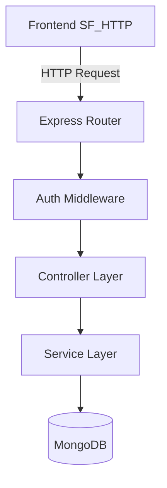

# API Reference

**Project Brain Version**: 1.1
**Document Version**: 1.0.0
**Last Updated**: 2026-07-19
**Last Verified Against Code**: 2026-07-19
**Current Phase**: Phase 2
**Current Milestone**: Milestone 2.2
**Related Documents**: [DATABASE.md](DATABASE.md), [AUTHENTICATION.md](AUTHENTICATION.md), [ROUTING.md](ROUTING.md)

---

## 1. Overview
The StudyFlow AI backend exposes a RESTful JSON API using Express. All protected routes require a JWT Bearer token. Controllers handle HTTP layer logic, while Services handle business logic.

## 2. API Dependency Architecture

## 3. Implementation: Authentication Endpoints (`/api/auth`)

| Method | Route | Auth Req | Controller | Description |
|---|---|---|---|---|
| `POST` | `/api/auth/register` | No | `AuthController.register` | Creates a new user. Expects `{ name, email, password }`. |
| `POST` | `/api/auth/login` | No | `AuthController.login` | Authenticates user. Expects `{ email, password }`. Returns `{ token, user }`. |
| `POST` | `/api/auth/refresh` | No | `AuthController.refresh` | Refreshes JWT using a refresh token. |
| `GET`  | `/api/auth/status` | Opt | `AuthController.getStatus` | Health check returning auth status. |
| `POST` | `/api/auth/logout` | Yes | `AuthController.logout` | Invalidates current session/token. |
| `GET`  | `/api/auth/me`     | Yes | `AuthController.getMe`    | Returns current user profile. |
| `PATCH`| `/api/auth/profile`| Yes | `AuthController.updateProfile` | Updates user settings/profile. |

## 4. Implementation: Goal Endpoints (`/api/goals`)

| Method | Route | Auth Req | Controller | Description |
|---|---|---|---|---|
| `GET`  | `/api/goals` | Yes | `GoalController.getGoals` | Returns all goals for the authenticated user. |
| `POST` | `/api/goals` | Yes | `GoalController.createGoal` | Creates a new goal. Expects `{ title, urgency, deadline, description }`. |
| `PUT`  | `/api/goals` | Yes | `GoalController.bulkSaveGoals` | Overwrites multiple goals (legacy support for local storage migrations). |
| `GET`  | `/api/goals/:id` | Yes | `GoalController.getGoalById` | Retrieves a specific goal. |
| `PATCH`| `/api/goals/:id` | Yes | `GoalController.updateGoal` | Updates goal metadata or subtasks. |
| `DELETE`| `/api/goals/:id` | Yes | `GoalController.deleteGoal` | Permanently deletes a goal and subtasks. |
| `PATCH`| `/api/goals/:goalId/subtasks/:subtaskId/toggle` | Yes | `GoalController.toggleSubtask` | Toggles subtask completion status. |

## 5. Implementation: Planner Endpoints (`/api/planner`)

| Method | Route | Auth Req | Controller | Description |
|---|---|---|---|---|
| `GET`  | `/api/planner/daily` | Yes | `PlannerController.getDailyBlocks` | Gets planner blocks for the current day. |
| `GET`  | `/api/planner/deadlines` | Yes | `PlannerController.getUpcomingDeadlines` | Gets upcoming planner deadlines. |
| `GET`  | `/api/planner/events` | Yes | `PlannerController.getEventsByRange` | **Crucial:** Used by `SF_STORE` to cache `allBlocks` for Workspace linking. Expects `?limit=2000` or date bounds. |
| `POST` | `/api/planner` | Yes | `PlannerController.createEvent` | Creates a new block. Expects `{ title, startTime, endTime, goalId, milestoneId }`. |
| `PATCH`| `/api/planner/:id` | Yes | `PlannerController.updateEvent` | Updates a specific planner block. |
| `DELETE`| `/api/planner/:id` | Yes | `PlannerController.deleteEvent` | Deletes a planner block. |

## 6. Implementation: Focus Endpoints (`/api/focus`)

| Method | Route | Auth Req | Controller | Description |
|---|---|---|---|---|
| `GET`  | `/api/focus/sprint-task` | Yes | `FocusController.getSprintTask` | Suggests the next task for a pomodoro session. |
| `GET`  | `/api/focus/ai-suggestion` | Yes | `FocusController.getAISuggestion` | AI-generated focus advice. |
| `POST` | `/api/focus` | Yes | `FocusController.createSession` | Logs a completed pomodoro session. |

## 7. Common Pitfalls & Notes
- **Undefined Controllers**: Always ensure the Service is properly injected into the Controller. The frontend will throw a 500 if a method like `createBlock` is called but not exported.
- **ObjectId Casting**: Mongoose strictly enforces `ObjectId` formats (24 hex characters). If the frontend sends a string like `"blk-123"` for a `goalId`, the backend will crash with a `Cast to ObjectId failed` error.
- **Error Handling**: All routes are wrapped in an async error handler in the controller layer that formats errors consistently (e.g., `{ success: false, message: "Error" }`).

## Document History
| Version | Date | Summary of Changes |
|---|---|---|
| 1.0.0 | 2026-07-19 | Initial creation of Project Brain documentation. |

---
**Related Documents**: [DATABASE.md](DATABASE.md), [AUTHENTICATION.md](AUTHENTICATION.md), [ROUTING.md](ROUTING.md)
**Update Guidelines**: Keep this document updated whenever a new Express route is defined in `/backend/src/routes/`.
**Document Version**: 1.0.0
