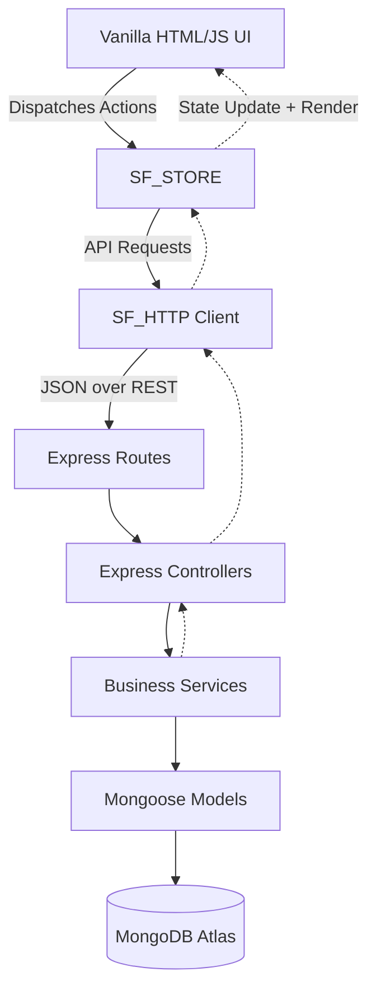

# Architecture

**Project Brain Version**: 1.1
**Document Version**: 1.0.0
**Last Updated**: 2026-07-19
**Last Verified Against Code**: 2026-07-19
**Current Phase**: Phase 2
**Current Milestone**: Milestone 2.2
**Related Documents**: [ROUTING.md](ROUTING.md), [STATE_MANAGEMENT.md](STATE_MANAGEMENT.md), [DATA_FLOW.md](DATA_FLOW.md)

---

## High-Level Diagram

## Frontend Architecture
The frontend is a Custom Single Page Application (SPA) built without a framework (No React/Vue). It is strictly composed of:
1. **Views (HTML)**: Located in `/frontend/`, these are static `.html` files (e.g., `workspace.html`) loaded once by the browser. 
2. **Router (`router.js`)**: Intercepts navigation to prevent page reloads, fetching page-specific JS modules on demand, allowing global elements (like Focus timers/music) to persist across navigations.
3. **State Management (`store.js`)**: Contains `SF_STORE`, a unidirectional, centralized state container that manages all data (goals, tasks, planner events) and emits events to trigger UI re-renders.
4. **Components (`components.js`)**: Functions that take raw data from `SF_STORE` and return HTML strings, which are then injected into the DOM.
5. **HTTP Client (`http.js`)**: A wrapper around `fetch()` (`SF_HTTP`) that handles auth token injection, error parsing, and centralized logging.

## Backend Architecture
The backend is a Node.js Express server acting strictly as a JSON API, organized in a 3-tier architecture.
1. **Routes (`/backend/src/routes/`)**: Define the API endpoints (e.g., `GET /api/planner`) and attach middleware (Auth, Validation) and map them to specific Controller methods.
2. **Controllers (`/backend/src/controllers/`)**: Responsible ONLY for parsing incoming HTTP requests (body, params, query), calling the appropriate Service, and formatting the HTTP response (status codes, JSON).
3. **Services (`/backend/src/services/`)**: The core business logic layer. Controllers pass pure data to Services. Services execute logic, orchestrate multiple database queries, format data, and throw standard Error objects if something fails.
4. **Models (`/backend/src/models/`)**: Mongoose schemas defining the data structure, indexes, and validation rules for MongoDB.

## Why this Architecture?
- **Decoupling**: The frontend can be completely rebuilt in React later without changing a single line of backend code. 
- **Testability**: The backend business logic (Services) can be tested entirely independently of HTTP requests (Controllers).
- **Performance**: Vanilla JS provides instant load times without heavy bundles, while `SF_STORE` enables optimistic UI updates so the interface feels instantaneous even if the backend is slow.

## Document History
| Version | Date | Summary of Changes |
|---|---|---|
| 1.0.0 | 2026-07-19 | Initial creation of Project Brain documentation. |

---
**Related Documents**: [ROUTING.md](ROUTING.md), [STATE_MANAGEMENT.md](STATE_MANAGEMENT.md), [DATA_FLOW.md](DATA_FLOW.md)
**Update Guidelines**: Modify this document if a major framework (like React or Next.js) is adopted or the 3-tier backend structure changes.
**Document Version**: 1.0.0
