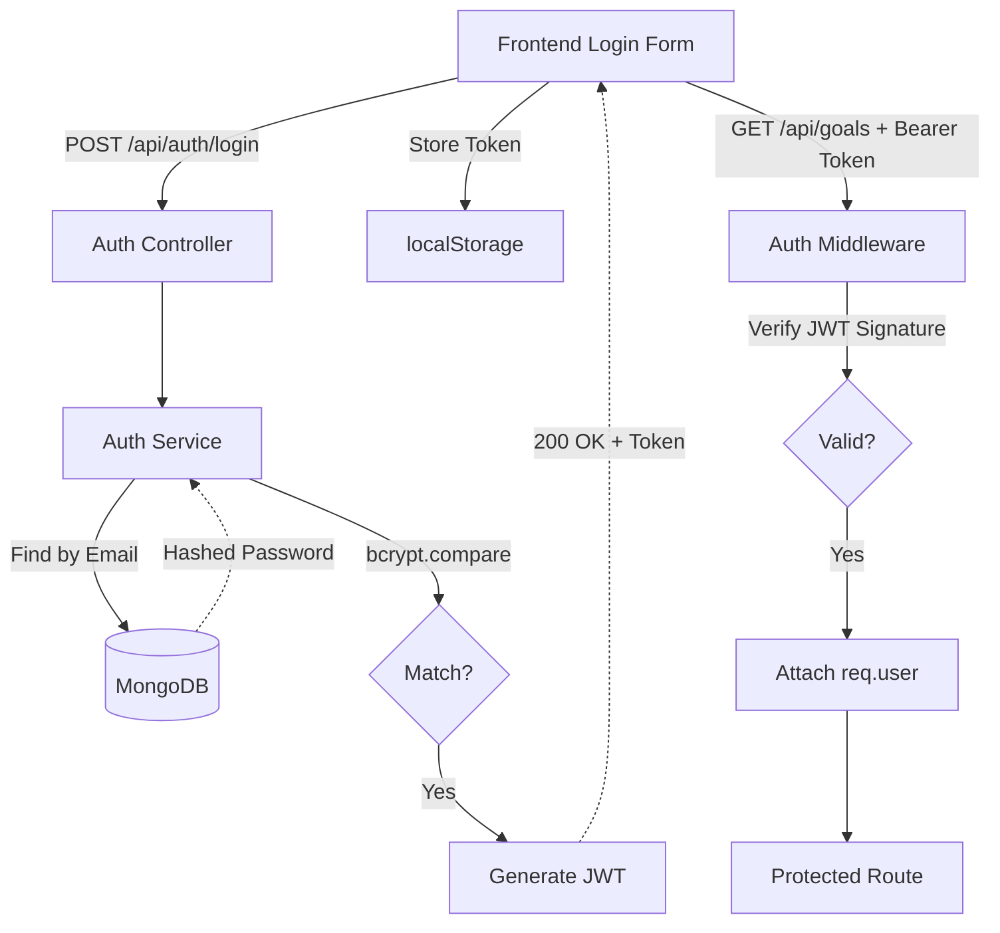

# Authentication

**Project Brain Version**: 1.1
**Document Version**: 1.0.0
**Last Updated**: 2026-07-19
**Last Verified Against Code**: 2026-07-19
**Current Phase**: Phase 2
**Current Milestone**: Milestone 2.2
**Related Documents**: [API_REFERENCE.md](API_REFERENCE.md), [DATA_FLOW.md](DATA_FLOW.md)

---

## 1. Overview
StudyFlow AI uses standard stateless JSON Web Tokens (JWT) for authentication. When a user logs in, the backend issues an access token. The frontend includes this token in the `Authorization: Bearer <token>` header of subsequent API requests.

## 2. Architecture & Flow Diagram

## 3. Implementation Details

### Login Flow
1. User submits email/password.
2. `AuthService.login()` queries the `User` model by email (requesting the hidden `password` field via `+password`).
3. Uses `user.comparePassword()` (a mongoose instance method leveraging `bcryptjs`).
4. Generates a signed JWT containing `{ id: user._id, tokenVersion: user.tokenVersion }`.
5. Returns token to the client.

### Registration Flow
1. User submits name/email/password.
2. `AuthService.register()` checks if email exists.
3. Creates new `User` document. Mongoose `pre('save')` middleware intercepts the save and hashes the plaintext password using `bcryptjs` with 12 salt rounds.
4. Generates token and logs user in immediately.

### JWT Validation & Middleware (`auth.middleware.js`)
The `authenticate` middleware protects standard endpoints:
1. Extracts token from `Authorization` header OR `req.cookies`.
2. Verifies signature using `jsonwebtoken`.
3. Looks up `User` by `decoded.id`.
4. **Crucial Security Step**: Compares `decoded.tokenVersion` against `user.tokenVersion`. If they don't match, the token is rejected. (This allows forcing global logouts by incrementing `user.tokenVersion` in the DB).
5. Attaches `req.user` to the Express request object.

### Token Storage (Frontend)
Tokens are managed by `/frontend/src/js/services/authService.js`.
- Access tokens are stored in `localStorage` under the key `accessToken` (configured via `SF_CONFIG.AUTH_TOKEN_KEY`).
- `SF_HTTP` automatically reads this token and injects it into every request.

## 4. Session Lifecycle & Logout
- **Logout**: Triggers `POST /api/auth/logout`. The frontend clears `localStorage('accessToken')` and redirects to `login.html`.
- **Token Expiry**: Handled by the JWT library. If expired, `auth.middleware.js` catches it and throws a 401 Unauthorized. The frontend `SF_HTTP` client catches 401s globally and redirects to the login screen.

## 5. Common Pitfalls & Notes
- **Password Selection**: Because the `User` model sets `select: false` on the password field, standard queries (`User.findOne()`) will NOT return the password. Services MUST use `.select('+password')` if they need to perform a password comparison.
- **IsVerified**: The backend includes an `isVerified` flag on the `User` model, but it currently defaults to `true`. OTP/Email validation flows are explicitly disabled for this phase per requirements.

## Document History
| Version | Date | Summary of Changes |
|---|---|---|
| 1.0.0 | 2026-07-19 | Initial creation of Project Brain documentation. |

---
**Related Documents**: [API_REFERENCE.md](API_REFERENCE.md), [DATA_FLOW.md](DATA_FLOW.md)
**Update Guidelines**: Update this document if the JWT storage mechanism changes (e.g., migrating from `localStorage` to `HttpOnly` cookies).
**Document Version**: 1.0.0
