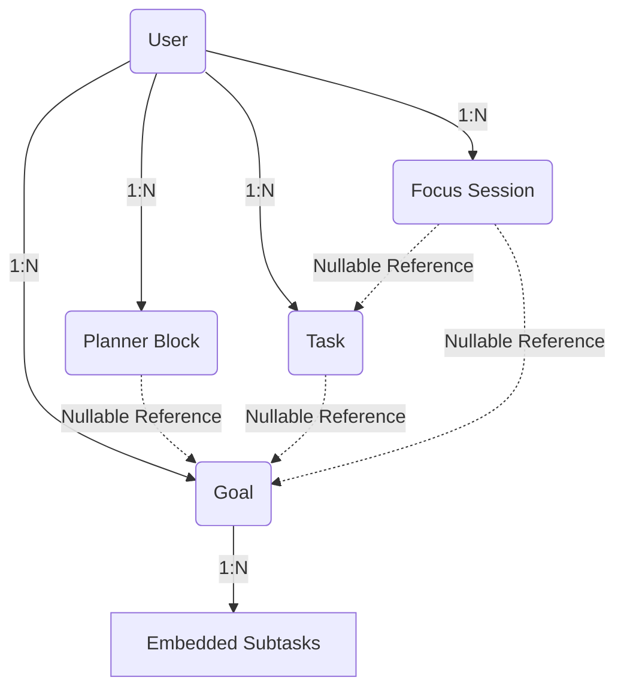

# Database

**Project Brain Version**: 1.1
**Document Version**: 1.0.0
**Last Updated**: 2026-07-19
**Last Verified Against Code**: 2026-07-19
**Current Phase**: Phase 2
**Current Milestone**: Milestone 2.2
**Related Documents**: [API_REFERENCE.md](API_REFERENCE.md), [DATA_FLOW.md](DATA_FLOW.md)

---

## 1. Overview
StudyFlow AI uses MongoDB Atlas as its primary datastore, managed via Mongoose 8.x. The database architecture is highly decoupled, preferring document isolation over deep nesting to allow for horizontal scaling and distinct feature life-cycles (e.g., Planner blocks are separate from Goals).

## 2. Architecture & Entity Relationship Diagram

## 3. Implementation Details

### User Model (`User.js`)
- **Purpose**: Core authentication and profile model.
- **Fields**:
  - `name`: String, required.
  - `email`: String, required, unique, lowercase.
  - `password`: String, required, *select: false* (hidden from default queries).
  - `avatar`: String, dynamically generated fallback.
  - `role`: String (student, admin).
  - `isVerified`: Boolean, defaults to true (No OTP flow required).
  - `refreshToken`: String, *select: false*.
- **Indexes**: `{ email: 1 }`, `{ refreshToken: 1 }`
- **Important Notes**: Uses a pre-save middleware to hash passwords with `bcryptjs` (12 salt rounds). Returns JSON without `password`, `refreshToken`, or `__v`.

### Goal Model (`Goal.js`)
- **Purpose**: Defines a major project or study module.
- **Fields**:
  - `user`: ObjectId, required, ref `User`.
  - `title`: String, required.
  - `description`: String.
  - `status`: String (ACTIVE, COMPLETED).
  - `urgency`: String (URGENT, UPCOMING, ACTIVE, COMPLETED).
  - `deadline`: String (YYYY-MM-DD).
  - `subtasks`: Array of embedded `subtaskSchema`.
  - `completed`: Boolean.
- **Embedded `subtaskSchema`**:
  - `title`: String, required.
  - `estimate`: String, default '1h'.
  - `priority`: String (Low, Medium, High, URGENT).
  - `completed`: Boolean.
- **Indexes**: `{ user: 1, status: 1 }`, `{ user: 1, completed: 1 }`

### Planner Model (`Planner.js`)
- **Purpose**: Represents an active calendar block in the Smart Planner.
- **Fields**:
  - `user`: ObjectId, required, ref `User`.
  - `title`: String, required.
  - `startTime`: Date, required.
  - `endTime`: Date, required.
  - `type`: String (STUDY).
  - `goalId`: ObjectId, nullable, ref `Goal` (Used to link to Workspace).
  - `milestoneId`: String, nullable (Used to link to specific subtask).
  - `isRecurring`: Boolean (Sprint 3D prep).
- **Indexes**: `{ user: 1, startTime: 1 }`, `{ user: 1, seriesId: 1, exDate: 1 }`
- **Important Notes**: The combination of `goalId` and `milestoneId` is how the Workspace determines if a milestone is scheduled.

### Task Model (`Task.js`)
- **Purpose**: Loose generic tasks (To-dos) not strictly bound to a massive Goal structure.
- **Fields**:
  - `user`: ObjectId, required.
  - `title`: String, required.
  - `status`: String.
  - `priority`: String.
  - `estimatedMinutes`: Number.
  - `actualMinutes`: Number.
  - `goalId`: ObjectId, nullable.
- **Indexes**: `{ user: 1, status: 1 }`, `{ user: 1, dueDate: 1 }`

### FocusSession Model (`FocusSession.js`)
- **Purpose**: Tracks Pomodoro timer sessions for analytics.
- **Fields**:
  - `user`: ObjectId, required.
  - `type`: String (POMODORO).
  - `status`: String (IN_PROGRESS, COMPLETED).
  - `startTime`: Date, required.
  - `duration`: Number (minutes).
  - `interruptions`: Number.
  - `goalId`, `taskId`: ObjectId, nullable.
- **Indexes**: `{ user: 1, startTime: -1 }`

## 4. Data Ownership & Rules
- **Ownership**: Every entity EXCEPT `User` strictly requires a `user` ObjectId field. 
- **Cascade Behavior**: Hard cascade deletes are currently implemented via services, not database triggers. If a Goal is deleted, its associated Planner blocks remain orphaned unless explicitly deleted by the controller logic. (Needs Verification).
- **Validation**: All models use Mongoose built-in validations. Frontend data is trusted but verified against schema types.

## Document History
| Version | Date | Summary of Changes |
|---|---|---|
| 1.0.0 | 2026-07-19 | Initial creation of Project Brain documentation. |

---
**Related Documents**: [API_REFERENCE.md](API_REFERENCE.md), [DATA_FLOW.md](DATA_FLOW.md)
**Update Guidelines**: Update whenever a Mongoose schema is altered, a new index is added, or a new model is introduced.
**Document Version**: 1.0.0
