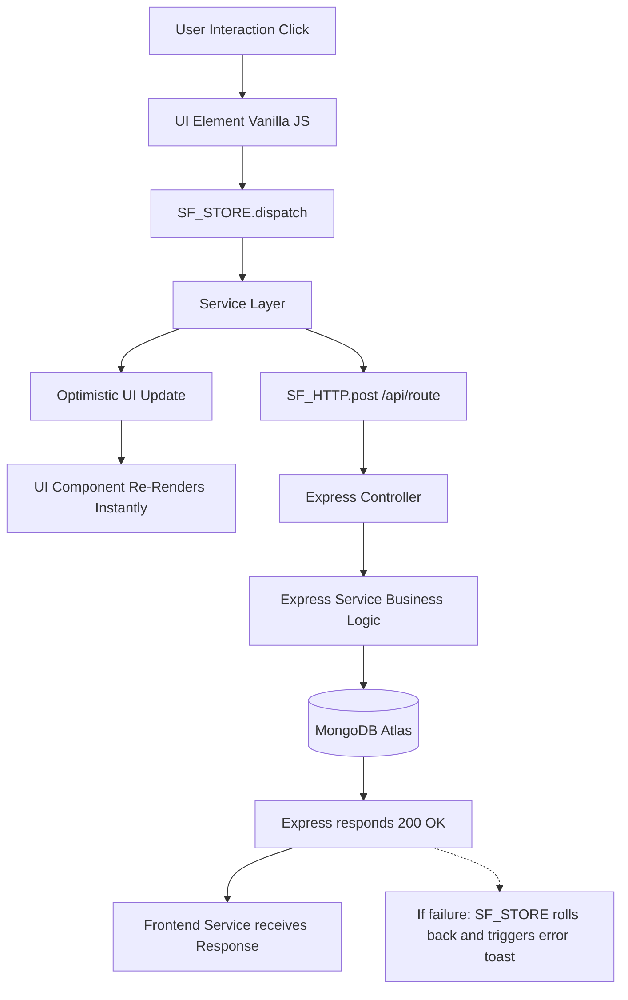

# Data Flow

**Project Brain Version**: 1.1
**Document Version**: 1.0.0
**Last Updated**: 2026-07-19
**Last Verified Against Code**: 2026-07-19
**Current Phase**: Phase 2
**Current Milestone**: Milestone 2.2
**Related Documents**: [ARCHITECTURE.md](ARCHITECTURE.md), [STATE_MANAGEMENT.md](STATE_MANAGEMENT.md)

---

## The Master Data Flow
Almost every interaction in StudyFlow AI follows this standard unidirectional lifecycle:

## Specific Feature Flows

### 1. Authentication (Login)
1. User submits Login Form on `login.html`.
2. Form directly calls `authService.login(email, password)`.
3. `SF_HTTP` sends `POST /api/auth/login`.
4. Backend `AuthController` delegates to `AuthService`.
5. `AuthService` queries MongoDB `User` model, compares bcrypt hash.
6. `AuthService` signs JWT and returns `{ token, user }`.
7. `authService.js` stores token in `localStorage('accessToken')`.
8. `window.location.href = 'dashboard.html'`.

### 2. Workspace Goals & Milestones Bootstrap
1. User navigates to `workspace.html`.
2. `SF_ROUTER` initializes the workspace logic.
3. Workspace calls `SF_STORE.bootstrap(['goals', 'planner'])`.
4. `goalsService` fetches `GET /api/goals`.
5. `plannerService` fetches `GET /api/planner/events` (the `allBlocks` cache).
6. Store triggers subscribers.
7. Workspace `render()` loops through goals.
8. For each milestone, `plannerService.getBlockForMilestone(goalId, milestoneId)` checks the local `allBlocks` cache.
9. If found, UI renders "📅 Scheduled" badge. If not, renders "Schedule" button.

### 3. Scheduling a Milestone (The "Linking" Flow)
1. User clicks "Schedule" on a Milestone in the Workspace.
2. `window.openScheduleModal()` captures `goalId` and `milestoneId`.
3. User selects a date/time and clicks Submit.
4. `plannerService.createBlock()` is dispatched.
5. `SF_STORE` optimistically pushes the new block into `planner.allBlocks`.
6. Workspace UI re-renders instantly, replacing "Schedule" with "📅 Scheduled".
7. Backend `PlannerController` → `PlannerService` → saves `Planner` document to MongoDB.
8. Flow completes without UI stutter.

### 4. Cross-Page Navigation (Workspace → Planner)
1. User clicks the "📅 Scheduled" badge.
2. `window.location.href = 'planner.html?highlightBlock=blockId&date=2026-07-15'`.
3. `planner.html` loads.
4. `SF_ROUTER` parses query parameters.
5. Router waits for `SF_STORE.bootstrap()` to complete loading blocks for `2026-07-15`.
6. Router triggers `window.highlightPlannerBlock('blockId')`.
7. DOM scrolls to the block and applies a CSS pulse animation.

## Document History
| Version | Date | Summary of Changes |
|---|---|---|
| 1.0.0 | 2026-07-19 | Initial creation of Project Brain documentation. |

---
**Related Documents**: [ARCHITECTURE.md](ARCHITECTURE.md), [STATE_MANAGEMENT.md](STATE_MANAGEMENT.md)
**Update Guidelines**: Add new flows here whenever a significantly complex or non-standard feature is introduced.
**Document Version**: 1.0.0
