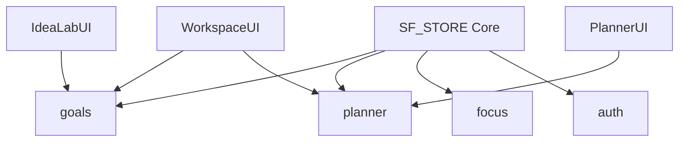

# Dependencies & Architecture Graph

**Project Brain Version**: 1.1
**Document Version**: 1.0.0
**Last Updated**: 2026-07-19
**Last Verified Against Code**: 2026-07-19
**Current Phase**: Phase 2
**Current Milestone**: Milestone 2.2
**Related Documents**: [ARCHITECTURE.md](ARCHITECTURE.md), [DEPLOYMENT.md](DEPLOYMENT.md)

---

## 1. Core System Files (Do Not Modify Lightly)
The following files form the structural foundation of the application. Modifying these without extreme caution will break the entire system.
- `frontend/src/js/store.js`: The global state manager.
- `frontend/src/js/http.js`: The global `SF_HTTP` fetch wrapper that handles JWT injection and 401 intercepts.
- `frontend/router/*.js`: The routing logic for SPA transitions.
- `backend/src/middleware/auth.middleware.js`: The security perimeter.

## 2. Store Dependency Graph
Many frontend features rely on interconnected slices of the store.

## 3. Backend Dependency Graph (NPM)
The backend is a Node.js Express application.

### Core Dependencies
- `express` (^4.18.x): HTTP Server framework.
- `mongoose` (^8.0.x): MongoDB ODM.
- `jsonwebtoken` (^9.0.x): JWT signing and verification.
- `bcryptjs` (^2.4.x): Password hashing.
- `cors` & `helmet`: Security middlewares.
- `dotenv`: Environment variable management.

### Dev Dependencies
- `nodemon`: Hot-reloading server for development.

## 4. Frontend Dependency Graph
The frontend is intentionally dependency-light (Vanilla JS).

### External CDNs
- **Tailwind CSS (Script)**: `https://cdn.tailwindcss.com`. Used for all styling. Configured inline via `tailwind.config`.
- **Google Fonts**: Inter, Outfit, Fira Code.
- **FontAwesome / Phosphor Icons**: Used for UI iconography.
- **FullCalendar (Future)**: Planned for Milestone 2.3 for rendering complex monthly views.

## 5. Architectural Risks
- **Tailwind via CDN**: Running Tailwind via a CDN script in production is a performance anti-pattern. This is acceptable for Phase 2 prototyping but must be replaced with a PostCSS build step before production deployment.
- **Lack of Bundler**: The frontend relies on manual `<script>` tag ordering in the HTML files. If `store.js` is loaded after `goalsService.js`, the app crashes.

## Document History
| Version | Date | Summary of Changes |
|---|---|---|
| 1.0.0 | 2026-07-19 | Initial creation of Project Brain documentation. |

---
**Related Documents**: [ARCHITECTURE.md](ARCHITECTURE.md), [DEPLOYMENT.md](DEPLOYMENT.md)
**Update Guidelines**: Update when introducing a build step (Vite/Webpack) or new major NPM packages.
**Document Version**: 1.0.0
