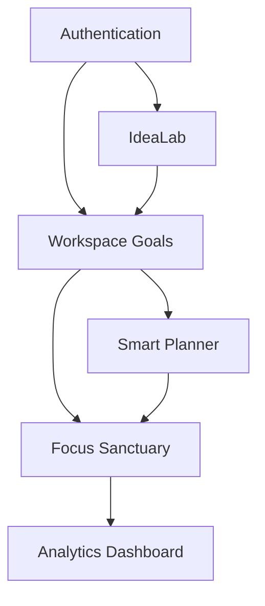

# Features Inventory

**Project Brain Version**: 1.1
**Document Version**: 1.0.0
**Last Updated**: 2026-07-19
**Last Verified Against Code**: 2026-07-19
**Current Phase**: Phase 2
**Current Milestone**: Milestone 2.2
**Related Documents**: [WORKSPACE.md](WORKSPACE.md), [PLANNER.md](PLANNER.md), [IDEALAB.md](IDEALAB.md)

---

## 1. Feature Dependency Map

## 2. Workspace
- **Purpose**: Manage long-term goals and modular subtasks.
- **Business Value**: Allows students to break massive projects into trackable milestones.
- **Entry Point**: `workspace.html`
- **Frontend Files**: `workspace.html`, `router/workspace.router.js`, `src/js/services/goalsService.js`
- **Backend Files**: `goal.routes.js`, `goal.controller.js`, `goal.service.js`
- **Store Usage**: `SF_STORE (goals, planner.allBlocks)`
- **Database Models**: `Goal.js`
- **Current Status**: Complete. Block linking established.
- **Future Improvements**: Subtask dependency chaining.

## 3. Smart Planner
- **Purpose**: Daily, weekly, and monthly time-blocking.
- **Business Value**: Prevents procrastination via explicit scheduling of milestones.
- **Entry Point**: `planner.html`
- **Frontend Files**: `planner.html`, `router/planner.router.js`, `src/js/services/plannerService.js`
- **Backend Files**: `planner.routes.js`, `planner.controller.js`, `planner.service.js`
- **Store Usage**: `SF_STORE (planner)`
- **Database Models**: `Planner.js`
- **Current Status**: Complete up to Daily View and block linking.
- **Future Improvements**: Weekly/Monthly views, recurring exceptions (Sprint 3D).

## 4. IdeaLab
- **Purpose**: AI-guided ideation and project breakdown workflow.
- **Business Value**: Overcomes the "blank page" syndrome by using AI to structure the first steps of a complex assignment.
- **Entry Point**: `idealab.html`
- **Frontend Files**: `idealab.html`, `router/idealab.router.js`
- **Backend Files**: Currently fully client-side mocked.
- **Store Usage**: `SF_STORE (idealab, goals)`
- **Database Models**: Relies on `Goal.js` for final output.
- **Current Status**: UI mockups built. Awaiting real OpenAI/Gemini integration.
- **Future Improvements**: Direct LLM integration for automatic `Goal` payload generation.

## 5. Focus Sanctuary
- **Purpose**: Full-screen Pomodoro timer.
- **Business Value**: Enforces deep work and tracks actual time spent vs estimated time.
- **Entry Point**: `focus.html`
- **Frontend Files**: `focus.html`, `src/js/services/focusService.js`
- **Backend Files**: `focus.routes.js`, `focus.controller.js`, `focus.service.js`
- **Store Usage**: `SF_STORE (focus)`
- **Database Models**: `FocusSession.js`
- **Current Status**: Functional Pomodoro loop.
- **Future Improvements**: Spotify/Lofi background audio integration.

## 6. Analytics
- **Purpose**: Productivity heatmaps and velocity tracking.
- **Business Value**: Provides positive reinforcement by showing a student's focus streaks.
- **Entry Point**: `analytics.html`
- **Frontend Files**: `analytics.html`, `src/js/services/analyticsService.js`
- **Backend Files**: `analytics.routes.js`
- **Store Usage**: `SF_STORE (analytics)`
- **Database Models**: Aggregates from `FocusSession.js` and `Task.js`
- **Current Status**: Static KPI dashboards.
- **Future Improvements**: Real-time D3.js charting.

## Document History
| Version | Date | Summary of Changes |
|---|---|---|
| 1.0.0 | 2026-07-19 | Initial creation of Project Brain documentation. |

---
**Related Documents**: [WORKSPACE.md](WORKSPACE.md), [PLANNER.md](PLANNER.md), [IDEALAB.md](IDEALAB.md)
**Update Guidelines**: Add new features here before creating their deep-dive documents.
**Document Version**: 1.0.0
