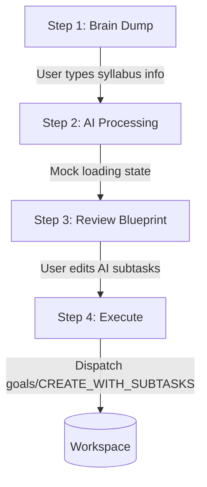

# IdeaLab Deep-Dive

**Project Brain Version**: 1.1
**Document Version**: 1.0.0
**Last Updated**: 2026-07-19
**Last Verified Against Code**: 2026-07-19
**Current Phase**: Phase 2
**Current Milestone**: Milestone 2.2
**Related Documents**: [WORKSPACE.md](WORKSPACE.md), [STATE_MANAGEMENT.md](STATE_MANAGEMENT.md)

---

## 1. Purpose
IdeaLab is an AI integration designed to eliminate the friction of starting a massive project. Instead of a student staring at a blank syllabus, they upload it to IdeaLab. The AI acts as a Study Coach, breaking the project down into subtasks, prioritizing them, and formally pushing them into the Workspace as structured `Goal` objects.

## 2. Business Goal
To differentiate StudyFlow AI from generic task managers by providing deeply integrated, education-focused AI generation rather than just a generic chat window.

## 3. Current Workflow (UI Mockup)
IdeaLab is built as a linear, 4-step wizard. Navigation is controlled via URL parameters (`idealab.html?step=2`).

- **Step 1**: The user enters their assignment details, requirements, and deadline.
- **Step 2**: An artificial loading screen simulating AI generation.
- **Step 3**: The UI presents the generated `Goal` and its `subtasks` for user approval.
- **Step 4**: The user confirms, saving the goal to the database, and is redirected to the Workspace.

## 4. Store Usage & Backend Integration
- **Store Slice**: `idealab`. It tracks the `activeGoal` being generated and `chatHistory` for conversational interactions.
- **Backend**: Currently, there is NO backend integration for IdeaLab. The frontend contains mocked data arrays that simulate an AI response.
- When the user completes Step 4, IdeaLab leverages the existing `goalsService.js` to dispatch `goals/CREATE_WITH_SUBTASKS`.

## 5. Current Limitations
- **Mock Data**: The system currently generates predefined arrays regardless of what the user types in Step 1.
- **Token Limits**: There is no architecture in place yet for handling large syllabus PDF uploads or parsing them within context windows.

## 6. Future AI Integration (Roadmap)
When real AI integration begins, the architecture must follow this pattern:
1. **Frontend**: `idealabService.js` sends the user's raw text to `POST /api/ai/generate-blueprint`.
2. **Backend**: An Express controller forwards the text to an `AiService`.
3. **LLM**: The `AiService` calls the OpenAI or Gemini API using Structured Outputs (JSON Schema) to guarantee the LLM returns an array of subtasks matching the `Goal` model requirements.
4. **Response**: The backend returns the JSON to the frontend.
5. **Approval**: The user reviews the JSON via the IdeaLab Step 3 UI.
6. **Save**: The user saves it, triggering the standard `POST /api/goals` endpoint.

## Document History
| Version | Date | Summary of Changes |
|---|---|---|
| 1.0.0 | 2026-07-19 | Initial creation of Project Brain documentation. |

---
**Related Documents**: [WORKSPACE.md](WORKSPACE.md), [STATE_MANAGEMENT.md](STATE_MANAGEMENT.md)
**Update Guidelines**: Major updates required when real LLM integrations (OpenAI/Gemini) are attached to the backend.
**Document Version**: 1.0.0
