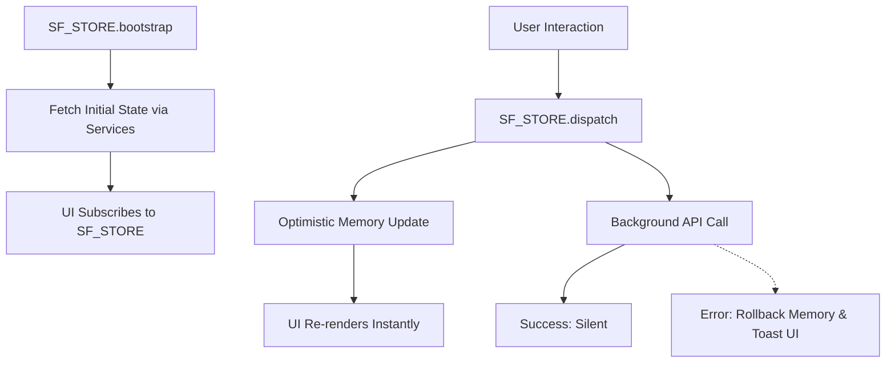

# State Management

**Project Brain Version**: 1.1
**Document Version**: 1.0.0
**Last Updated**: 2026-07-19
**Last Verified Against Code**: 2026-07-19
**Current Phase**: Phase 2
**Current Milestone**: Milestone 2.2
**Related Documents**: [ARCHITECTURE.md](ARCHITECTURE.md), [DATA_FLOW.md](DATA_FLOW.md)

---

## The `SF_STORE` Singleton
StudyFlow AI avoids component-level state chaos by centralizing all application data in a single, read-only memory object: `window.SF_STORE`. (Located in `/frontend/src/js/store.js`).

`SF_STORE` enforces a strictly unidirectional data flow similar to Redux but heavily simplified for Vanilla JS.
Components can **never** mutate the state directly.

### Slices
The state is divided into logical slices:
- `user`: Profile data, settings, active plan.
- `goals`: The user's projects, tasks, and subtasks.
- `planner`: Calendar blocks, daily schedules, and the `allBlocks` cache.
- `focus`: Pomodoro timer states, active tasks, distraction logs.
- `analytics`: KPIs, heatmaps, and charts.
- `idealab`: Active AI sessions and conversational history.
- `settings`: UI preferences and AI persona configs.

## The State Lifecycle



### 1. Bootstrap
When a page loads, the component calls `SF_STORE.bootstrap(['goals', 'planner'])`. 
This initiates fetching the initial state for those slices from the backend via their respective services (e.g., `goalsService`, `plannerService`).

### 2. Read (Subscribe)
UI components subscribe to slices. When a slice updates, the callback fires, and the component receives a fresh, deep-cloned copy of the slice to re-render.
```javascript
SF_STORE.subscribe('goals', (goalsSlice) => {
  renderWorkspaceGoals(goalsSlice.items);
});
```

### 3. Write (Dispatch)
When a user interacts with the UI (e.g., clicking "Complete Subtask"), the UI dispatches an action.
```javascript
SF_STORE.dispatch('goals/TOGGLE_SUBTASK', { goalId, subtaskId });
```

### 4. Service Execution & Optimistic Updates
The dispatcher intercepts the action and delegates it to the appropriate Service (e.g., `goalsService.toggleSubtask`).
- **Optimistic Update**: The Store immediately patches the state in memory, firing subscriptions instantly, making the UI feel zero-latency.
- **API Call**: The Service makes the actual `SF_HTTP` call to the backend in the background.

### 5. Rollback on Error
If the background API request fails, the Service throws an error. The Store catches this, rolls back the optimistic update to the previous state, and alerts the UI (usually triggering a toast notification).

## The `planner.allBlocks` Cache
A crucial architectural mechanic inside `SF_STORE` is the caching of Planner events. 
Because Goals and Planner events are stored in completely separate MongoDB collections, the frontend needs a way to quickly know if a Milestone is already scheduled without making an expensive API call every render.
- `SF_STORE` bootstraps `planner.allBlocks` (fetching all events via `GET /api/planner/events`).
- When rendering a Goal card, the component synchronously checks `allBlocks` to see if `goalId` and `milestoneId` exist. If so, it renders the "📅 Scheduled" badge instead of the "Schedule" button.


## Document History
| Version | Date | Summary of Changes |
|---|---|---|
| 1.0.0 | 2026-07-19 | Initial creation of Project Brain documentation. |

---
**Related Documents**: [ARCHITECTURE.md](ARCHITECTURE.md), [DATA_FLOW.md](DATA_FLOW.md)
**Update Guidelines**: Update whenever a new slice is added or the mutation paradigm shifts.
**Document Version**: 1.0.0
